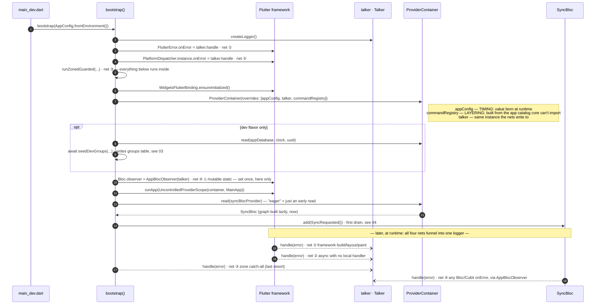

# 01 · Startup / DI + the four error nets

**Type:** sequence — startup *is* an order; the ordering is the content.
**Source:** [technical-summary §3](../technical-summary.md) + §7 (error nets) · [bootstrap.dart](../../lib/bootstrap.dart)

**Reading it**

- The two `throw UnimplementedError()` providers (`appConfig`, `commandRegistry`) fail
  loud at step 7 if an override is forgotten — timing vs layering, same fix.
- The only load-bearing ordering after the zone: net ④ before the sync kick, because
  `read(syncBlocProvider)` creates the app's **first Bloc**. The kick sits after
  `runApp` by priority (optional background work never delays or prevents the first
  frame), not by necessity.
- All four nets end in one `talker.handle` — one logger, one stream.

**Seams:** the DB the seed writes → `03-database-migrations` · the drain `SyncRequested`
starts → `04-sync-outbox` · the widget tree `runApp` mounts → `02-groups-slice`.
