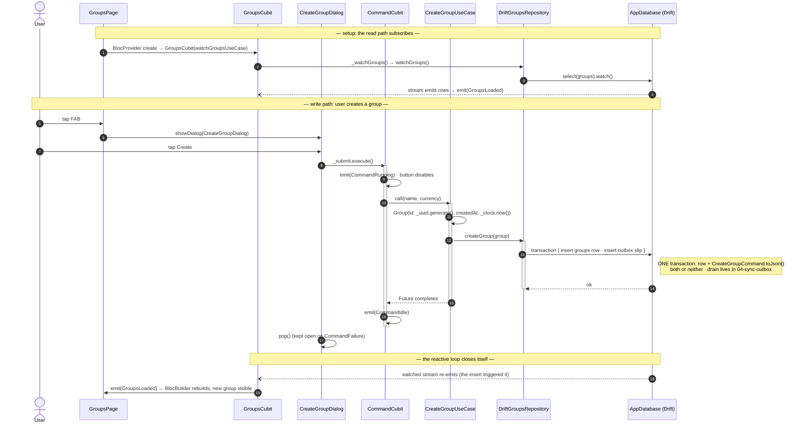

# 02 · Groups feature slice

**Type:** sequence — one vertical slice told as a story: the read path subscribes,
a write goes down the layers, and the reactive loop closes itself.
**Source:** [technical-summary §2](../technical-summary.md) + §4

**Reading it**

- **The read path never refreshes manually.** Drift's `watch()` re-emits on any
  write, so steps 18–19 happen *because of* step 13 — no "reload" call exists.
- **Two "Command"s, on purpose.** `CommandCubit` (MVVM) only guards the button
  lifecycle (Running → disabled). The thing serialised into the outbox is the *GoF*
  `CreateGroupCommand` — different object, different layer, drained in `04`.
- **The write is offline-first's signature move:** group row + outbox slip in one
  transaction — the screen update and the sync intent can never diverge.

**Seams:** DI wiring → `01-startup-di` · the transaction + outbox table →
`03-database-migrations` · what drains the queued command → `04-sync-outbox`.
