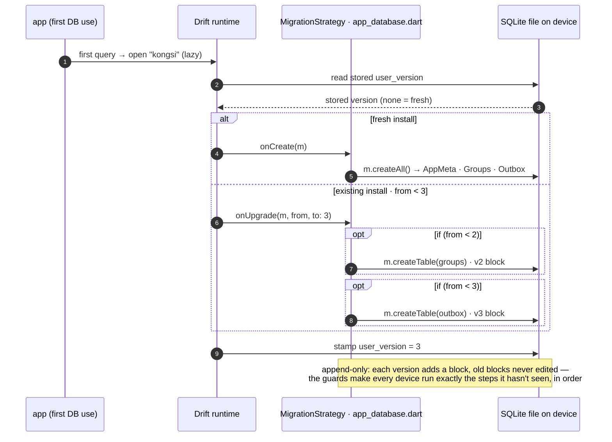

# 03 · Database / migrations

**Type:** sequence — Drift's runtime calling *our* migration callbacks (inversion of
control: we never call `onUpgrade` ourselves); the `if (from < N)` guards are the
`opt` blocks.
**Source:** [technical-summary §6](../technical-summary.md) · [app_database.dart](../../lib/core/database/app_database.dart)

---

**Tables (the v1→v3 shape)**

| Table | Columns (key) | Added |
|---|---|---|
| `AppMeta` | `key` (PK), `value` | v1 |
| `Groups` → `GroupRow` | `id` (PK), `name`, `currency`, `createdAt` | v2 |
| `Outbox` → `OutboxRow` | `id` (auto PK), `commandType`, `payloadJson`, `createdAt`, `attempts` (def 0), `status` (`pending`/`failed`) | v3 |

**War story — the v2→v3 bug.** An early version bumped `schemaVersion` to 3 but
**forgot the `createTable(outbox)` block.** A device on v2 got *stamped* v3 with no
outbox table; the next "create group" hit the missing table and failed. The save:
that write is **one transaction** (see `02-groups-slice`), so it rolled back whole —
**no orphan group** with a missing slip. Two lessons: migration blocks are
append-only, *and* wrapping the local write + enqueue in one transaction is what kept
data consistent while the schema was wrong.

**Seams:** who writes these tables in one transaction → `02-groups-slice` · how the
outbox rows drain and how `attempts`/`status` drive the retry ceiling → `04-sync-outbox`.
