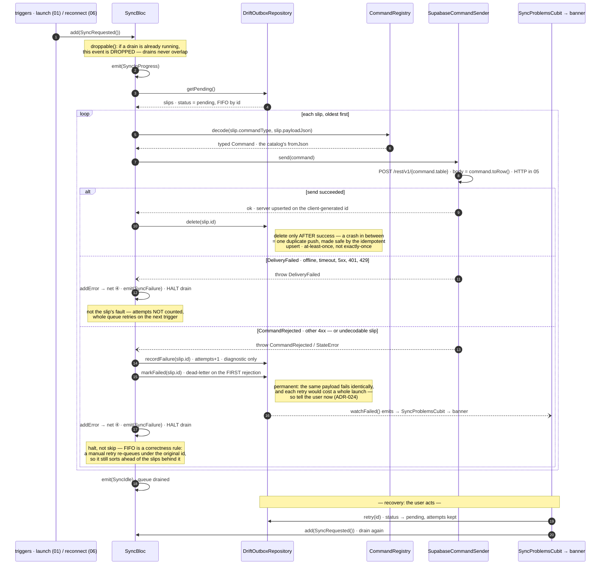

# 04 · Sync / outbox drain

**Type:** sequence — the drain is a story: trigger → decode → send → delete, with
two very different failure exits.
**Source:** [technical-summary §5](../technical-summary.md) · [sync_bloc.dart](../../lib/core/sync/sync_bloc.dart)

**Reading it**

- **The two failure exits are the whole design.** Only the slip's *own* fault
  (rejected / undecodable) is treated as permanent — if offline counted, a few
  offline launches would dead-letter perfectly good data.
- **A rejection dead-letters immediately and the user is told**
  ([ADR-024](../adr/ADR-024-surface-failed-syncs.md)). There's no retry ceiling:
  the same payload against the same server fails identically, and since the drain
  halts, each extra attempt would cost a whole launch or reconnect.
- **At-least-once, on purpose:** delete-after-send means a crash between them
  re-sends once; the server upserts on the client-generated id, so the repeat is a
  no-op. That upsert needs `Prefer: resolution=merge-duplicates` — **it is not the
  default**, and its absence made duplicates look like rejections for all of Phase 0.
- **`droppable` (step 2)** exists because two triggers can fire close together
  (launch + reconnect) — the second request is dropped, never queued.
- **Trigger 3 is deferred:** an enqueue-time kick (write while already online →
  drain immediately) lands in Phase 1; backoff waits for a retry timer to exist.

**Seams:** who enqueues the slip (one transaction) → `02-groups-slice` · the outbox
table + `attempts`/`status` columns → `03-database-migrations` · what `send()` does
on the wire (interceptors, TLS) → `05-network-stack` · the reconnect trigger →
`06-connectivity`.
