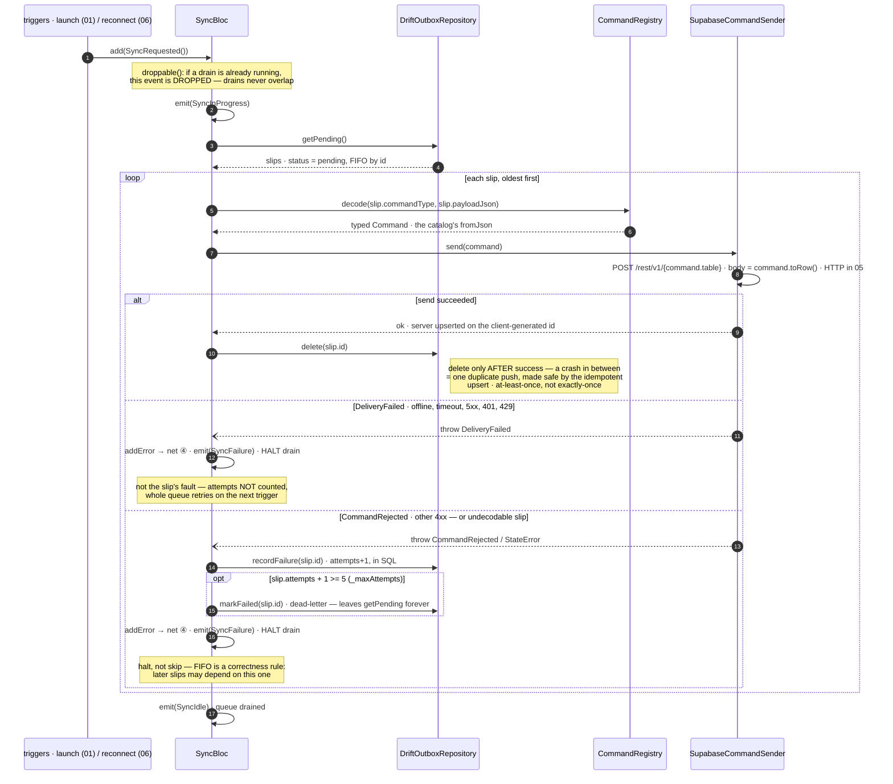

# 04 · Sync / outbox drain

**Type:** sequence — the drain is a story: trigger → decode → send → delete, with
two very different failure exits.
**Source:** [technical-summary §5](../technical-summary.md) · [sync_bloc.dart](../../lib/core/sync/sync_bloc.dart)

**Reading it**

- **The two failure exits are the retry ceiling's whole design.** Only the slip's
  *own* fault (rejected / undecodable) counts toward the 5-attempt ceiling — if
  offline failures counted, five offline app-launches would dead-letter good data.
- **At-least-once, on purpose (steps 10–11):** delete-after-send means a crash
  between them re-sends once; the server's upsert on `client_id` makes the repeat
  a no-op. Exactly-once would cost far more machinery for the same result.
- **`droppable` (step 2)** exists because two triggers can fire close together
  (launch + reconnect) — the second request is dropped, never queued.
- **Trigger 3 is deferred:** an enqueue-time kick (write while already online →
  drain immediately) lands in Phase 1; backoff waits for a retry timer to exist.

**Seams:** who enqueues the slip (one transaction) → `02-groups-slice` · the outbox
table + `attempts`/`status` columns → `03-database-migrations` · what `send()` does
on the wire (interceptors, TLS) → `05-network-stack` · the reconnect trigger →
`06-connectivity`.
