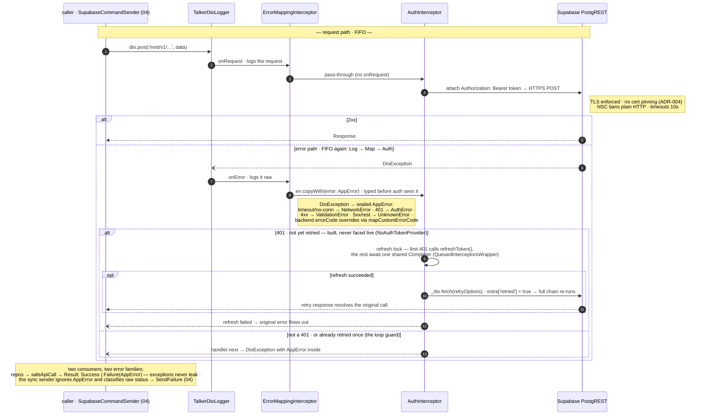

# 05 · Network stack & error model

**Type:** sequence — request → interceptor chain → PostgREST → typed error back.
**Source:** [technical-summary §7](../technical-summary.md) · [dio_client.dart](../../lib/core/network/dio_client.dart)

Dio runs interceptors in **FIFO (list) order for every hook** — requests *and*
errors (verified in dio 5.9.2 source, `dio_mixin.dart`). List order here:
`TalkerDioLogger → ErrorMappingInterceptor → AuthInterceptor`.

**Reading it**

- **FIFO is the subtle fact.** The mapper decorates the error *before* the auth
  interceptor handles it — auth reads the raw `statusCode`, so the dance still
  works, but the order is mapper-then-auth, not the reverse.
- **The 401 dance has two guards:** the refresh *lock* (ten 401s → one refresh, the
  rest wait) and the retry *marker* (`extra['retried']` — a second 401 means the
  token isn't the problem, give up). Unit-tested, but auth isn't wired yet.
- **Two error families by consumer:** the repo path wants "which `AppError` is it?"
  (`Result`, exhaustive `switch`); the sync path wants "does this count toward the
  retry ceiling?" (`SendFailure`) — same client, different questions.

**Seams:** the caller and what it does with `SendFailure` → `04-sync-outbox` ·
"online" is a hint, not a promise the server answers → `06-connectivity`.
