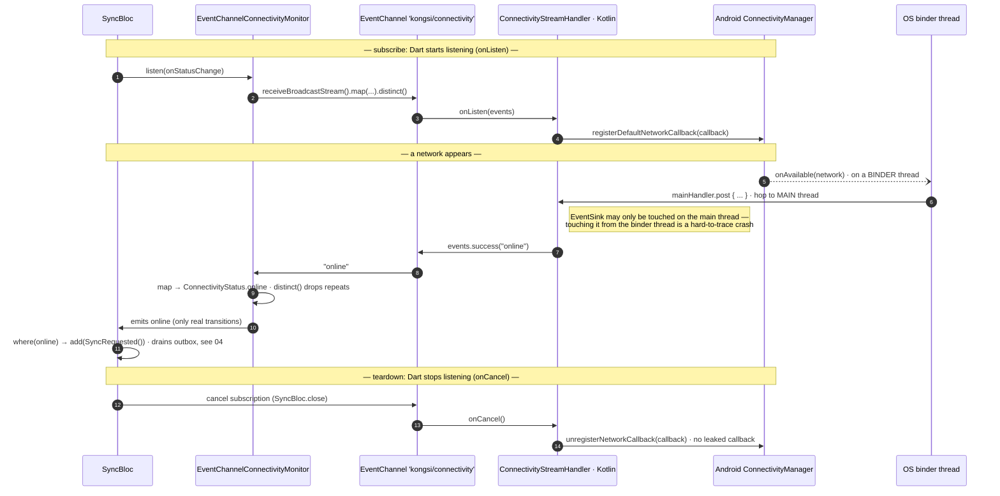

# 06 · Connectivity / platform interop

**Type:** sequence — native pushes network changes up an EventChannel; a returning
network kicks the drain. Shows the lifecycle (listen/cancel) and the thread hop.
**Source:** [technical-summary §8](../technical-summary.md) · [ConnectivityStreamHandler.kt](../../android/app/src/main/kotlin/com/wilbajamas/kongsi/ConnectivityStreamHandler.kt) · [event_channel_connectivity_monitor.dart](../../lib/core/connectivity/event_channel_connectivity_monitor.dart)

**Reading it**

- **Why an EventChannel, not a MethodChannel:** network state is a *stream of changes
  over time*, not a one-shot question. `onListen`/`onCancel` manage one long-lived
  subscription; `onCancel` unregisters so the callback can't leak.
- **The thread hop is the sharp bit.** OS callbacks land on a binder thread, but the
  `EventSink` is main-thread-only — `mainHandler.post { … }` hops back before every
  emit. Skip it and you get a crash that's hard to trace back here.
- **`.distinct()` is load-bearing** (marked *do not remove* in code): without it,
  duplicate "online" events would fire redundant drains.
- **Connectivity ≠ reachability:** "online" means a network *exists*, so it's a *hint
  to try* — the send in `04` still handles a failure if the server isn't actually
  reachable.

**Cross-platform honesty:** the iOS side is a **compiling Swift stub** — the channel
exists on both platforms so CI's macOS runner (see `07`) catches a break, even though
the real `NWPathMonitor` impl is deferred (no Mac).

**War story — `INTERNET` was debug-only.** Flutter's template declares `INTERNET`
only in the *debug* manifest; dev builds reached Supabase but a release/profile build
would ship with **no network permission**. Fix: move `INTERNET` +
`ACCESS_NETWORK_STATE` (the callback needs it) into the *main* manifest.

**Seams:** what `SyncRequested` drains → `04-sync-outbox` · the macOS runner that
compiles the iOS stub → `07-cicd`.
