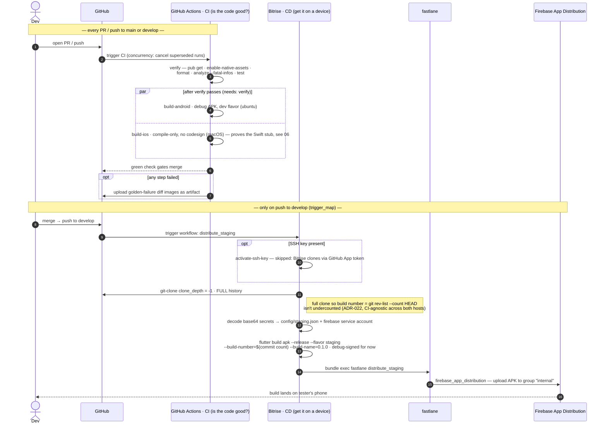

# 07 · CI/CD pipeline

**Type:** sequence — a commit's journey across two hosts split by responsibility:
GitHub Actions asks *"is the code good?"*, Bitrise + fastlane *"get the good build
onto a tester's phone."*
**Source:** [technical-summary §12](../technical-summary.md) · [.github/workflows/ci.yml](../../.github/workflows/ci.yml) · [bitrise.yml](../../bitrise.yml) · [Fastfile](../../android/fastlane/Fastfile)

**Reading it**

- **Two hosts, split by responsibility.** Actions is free + hand-written — the right
  place to *learn* CI and gate every PR. Release signing/store delivery lean on
  Mac-dependent tooling a no-Mac dev can't run locally — that's Bitrise's job.
- **The build number is why the clone is full** (`clone_depth: -1`): it's the git
  commit count, chosen because it's identical whichever host builds. A shallow clone
  would undercount it.
- **FAD is last-mile only** — it distributes a *built* APK; it does **not** need the
  Firebase SDK in the app (`firebase_core`/FCM are runtime concerns, added later).

**War story — auth vs authz (the sharpest lesson).** FAD kept returning "permission
denied." The key was **valid** — authentication *succeeded*. The failure was
**authorization**: a valid key for the *wrong service account* on the *wrong GCloud
project*. Fix: a service account with `roles/firebaseappdistro.admin`, API enabled,
on the correct project. Recognising *which* of the two is failing from the error is
the skill.

**Three more setup traps:** Bitrise *Release Management* ≠ *CI* (only CI builds from
source) · the `activate-ssh-key` step must be `run_if` SSH-present or it fails when
cloning via App token · config-as-code — `bitrise.yml` lives in the repo, reviewable.

**Seams:** the macOS `build-ios` job compiles the connectivity Swift stub → `06`.
